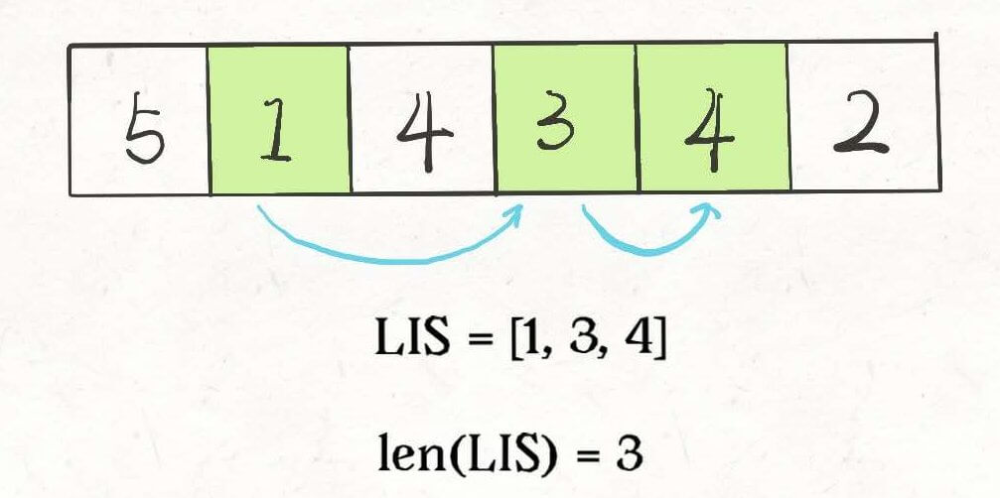

# 信封嵌套问题

很多算法问题都需要排序技巧，其难点不在于排序本身，而是需要巧妙地排序进行预处理，将算法问题进行转换，为之后的操作打下基础。

信封嵌套问题就需要先按特定的规则排序，之后就转换为一个 [最长递增子序列问题](../动态规划系列/动态规划设计：最长递增子序列.md)，可以用前文 [二分查找详解](二分查找详解.md) 的技巧来解决了。

### 一、题目概述

信封嵌套问题是个很有意思且经常出现在生活中的问题，先看下题目：


这道题目其实是最长递增子序列（Longes Increasing Subsequence，简写为 LIS）的一个变种，因为很显然，每次合法的嵌套是大的套小的，相当于找一个最长递增的子序列，其长度就是最多能嵌套的信封个数。

但是难点在于，标准的 LIS 算法只能在数组中寻找最长子序列，而我们的信封是由 `(w, h)` 这样的二维数对形式表示的，如何把 LIS 算法运用过来呢？



读者也许会想，通过 `w × h` 计算面积，然后对面积进行标准的 LIS 算法。但是稍加思考就会发现这样不行，比如 `1 × 10` 大于 `3 × 3`，但是显然这样的两个信封是无法互相嵌套的。

### 二、解法

这道题的解法是比较巧妙的：

**先对宽度 `w` 进行升序排序，如果遇到 `w` 相同的情况，则按照高度 `h` 降序排序。之后把所有的 `h` 作为一个数组，在这个数组上计算 LIS 的长度就是答案。**

画个图理解一下，先对这些数对进行排序：


然后在 `h` 上寻找最长递增子序列：


这个子序列就是最优的嵌套方案。

这个解法的关键在于，对于宽度 `w` 相同的数对，要对其高度 `h` 进行降序排序。因为两个宽度相同的信封不能相互包含的，逆序排序保证在 `w` 相同的数对中最多只选取一个。

下面看代码：

```java
// envelopes = [[w, h], [w, h]...]
public int maxEnvelopes(int[][] envelopes) {
    int n = envelopes.length;
    // 按宽度升序排列，如果宽度一样，则按高度降序排列
    Arrays.sort(envelopes, new Comparator<int[]>() 
    {
        public int compare(int[] a, int[] b) {
            return a[0] == b[0] ? 
                b[1] - a[1] : a[0] - b[0];
        }
    });
    // 对高度数组寻找 LIS
    int[] height = new int[n];
    for (int i = 0; i < n; i++)
        height[i] = envelopes[i][1];

    return lengthOfLIS(height);
}
```

关于最长递增子序列的寻找方法，在前文中详细介绍了动态规划解法,并用扑克牌游戏解释了二分查找解法，本文就不展开了，直接套用算法模板：

```java
/* 返回 nums 中 LIS 的长度 */
public int lengthOfLIS(int[] nums) {
    int piles = 0, n = nums.length;
    int[] top = new int[n];
    for (int i = 0; i < n; i++) {
        // 要处理的扑克牌
        int poker = nums[i];
        int left = 0, right = piles;
        // 二分查找插入位置
        while (left < right) {
            int mid = (left + right) / 2;
            if (top[mid] >= poker)
                right = mid;
            else
                left = mid + 1;
        }
        if (left == piles) piles++;
        // 把这张牌放到牌堆顶
        top[left] = poker;
    }
    // 牌堆数就是 LIS 长度
    return piles;
}
```

为了清晰，我将代码分为了两个函数， 你也可以合并，这样可以节省下 `height` 数组的空间。

此算法的时间复杂度为 $O(NlogN)$，因为排序和计算 LIS 各需要 $O(NlogN)$ 的时间。

空间复杂度为 $O(N)$，因为计算 LIS 的函数中需要一个 `top` 数组。

### 三、总结

这个问题是个 Hard 级别的题目，难就难在排序，正确地排序后此问题就被转化成了一个标准的 LIS 问题，容易解决一些。

其实这种问题还可以拓展到三维，比如说现在不是让你嵌套信封，而是嵌套箱子，每个箱子有长宽高三个维度，请你算算最多能嵌套几个箱子？

我们可能会这样想，先把前两个维度（长和宽）按信封嵌套的思路求一个嵌套序列，最后在这个序列的第三个维度（高度）找一下 LIS，应该能算出答案。

实际上，这个思路是错误的。这类问题叫做「偏序问题」，上升到三维会使难度巨幅提升，需要借助一种高级数据结构「树状数组」，有兴趣的读者可以自行搜索。

有很多算法问题都需要排序后进行处理，阿东正在进行整理总结。希望本文对你有帮助。

坚持原创高质量文章，致力于把算法问题讲清楚，欢迎关注我的公众号 labuladong 获取最新文章：


[上一篇：区间调度之区间交集问题](区间交集问题.md)

[下一篇：几个反直觉的概率问题](几个反直觉的概率问题.md)

[目录](../../README.md#目录)